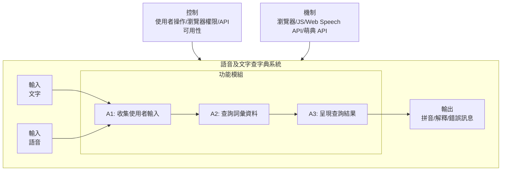

# IDEF0 功能描述: A1 語音及文字查字典

## A-0 (情境)
- **功能 (F):** 提供使用者透過文字輸入或語音辨識的方式，查詢中文詞彙的拼音與解釋。
- **輸入 (I):**
    - 使用者輸入的文字 (Typed text)
    - 使用者的語音 (User's speech)
- **控制 (C):**
    - 使用者操作 (點擊查詢/麥克風按鈕、按下 Enter)
    - 瀏覽器麥克風使用權限
    - API 的可用性 (Web Speech API, 萌典 API)
- **機制 (M):**
    - Web 瀏覽器 (負責執行 JavaScript 與渲染畫面)
    - JavaScript 程式碼 (包含事件監聽、功能函式)
    - Web Speech API (瀏覽器內建的語音轉文字服務)
    - 萌典 API (外部的字典資料查詢服務)
    - 網際網路連線
- **輸出 (O):**
    - 詞彙的拼音與解釋
    - UI 狀態回饋 (如 "查詢中...", "正在聆聽...")
    - 錯誤訊息 (如查無此字、辨識失敗、網路錯誤)

## A0 分解 (功能模組)

整個程式的運作可以分解為以下三個核心功能模組：

- **A1 收集使用者輸入 (Collect User Input):** 此模組負責從使用者端獲取欲查詢的詞彙，並將其轉換為標準的文字字串。它包含兩種輸入路徑。
    - **路徑一 (文字):** 監聽輸入框的 `Enter` 按鍵與「查詢」按鈕的點擊事件，直接取得輸入框中的文字。
    - **路徑二 (語音):** 監聽「麥克風」按鈕點擊事件，啟動瀏覽器的 Web Speech API。在辨識成功後，從 API 結果中提取出文字稿。
    - **輸出:** 一個包含目標詞彙的文字字串。

- **A2 查詢詞彙資料 (Query Word Data):** 此模組接收文字字串後，向外部的「萌典 API」發起網路請求以獲取詞彙的詳細資料。
    - **輸入:** 從 A1 模組傳來的文字字串。
    - **機制:** 使用瀏覽器的 `fetch` API 進行非同步網路請求。
    - **控制:** 網路連線狀態、萌典 API 的伺服器狀態。
    - **輸出:** 成功時輸出包含拼音與解釋的 JSON 物件；失敗時輸出錯誤狀態。

- **A3 呈現查詢結果 (Present Query Result):** 此模組負責將查詢結果或錯誤訊息，格式化為 HTML 並更新到網頁畫面上，提供使用者最終的回饋。
    - **輸入:** 從 A2 模組傳來的 JSON 物件或錯誤狀態。
    - **機制:** 操作 DOM (Document Object Model) 來動態產生 HTML 元素。
    - **輸出:** 更新後的網頁畫面，顯示查詢結果或錯誤訊息。

## Mermaid 架構圖

