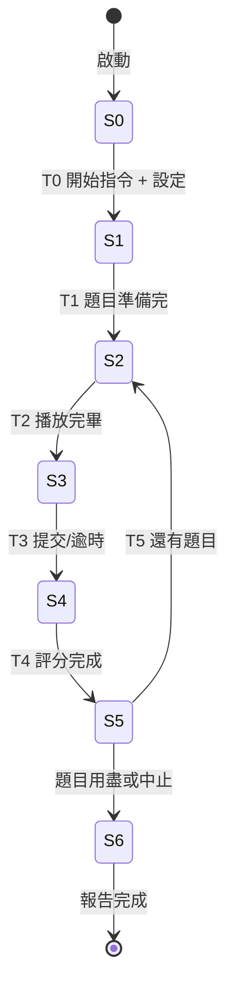

# Grafcet 狀態機（聽寫練習流程）

## SFC 步驟與轉移
- S0 等待/閒置：等待家長選題與孩子進入練習。T0：收到開始指令與題組配置。
- S1 載入題組：抓取 practice_set、預抓或生成語音。T1：成功準備下一題。
- S2 播放題目：播放語音，顯示提示（題號/剩餘題數）。T2：播放完成且手寫板就緒。
- S3 作答收集：孩子手寫或輸入，允許重播。T3：提交/逾時/跳題。
- S4 評分處理：比對結果（字/字形），記錄錯誤。T4：評分完成。
- S5 回饋展示：顯示正確字詞、差異提示，更新統計。T5：家長配置允許下一題且尚有題目。
- S6 結束/總結：所有題目完成或家長中止，展現報告並同步結果。

## Mermaid 狀態圖（近似 Grafcet）

## 事件/動作摘要
- T0：家長/系統下達開始，鎖定題組與設定。
- T1：TTS 生成或快取完成；API 更新音訊 URL。
- T2：音訊播放完成，前端手寫區啟用。
- T3：孩子提交、家長強制跳題或時間到。
- T4：比對完畢，計分與記錄寫入 DB。
- T5：若仍有題目，載入下一題；否則切換到 S6 總結。
