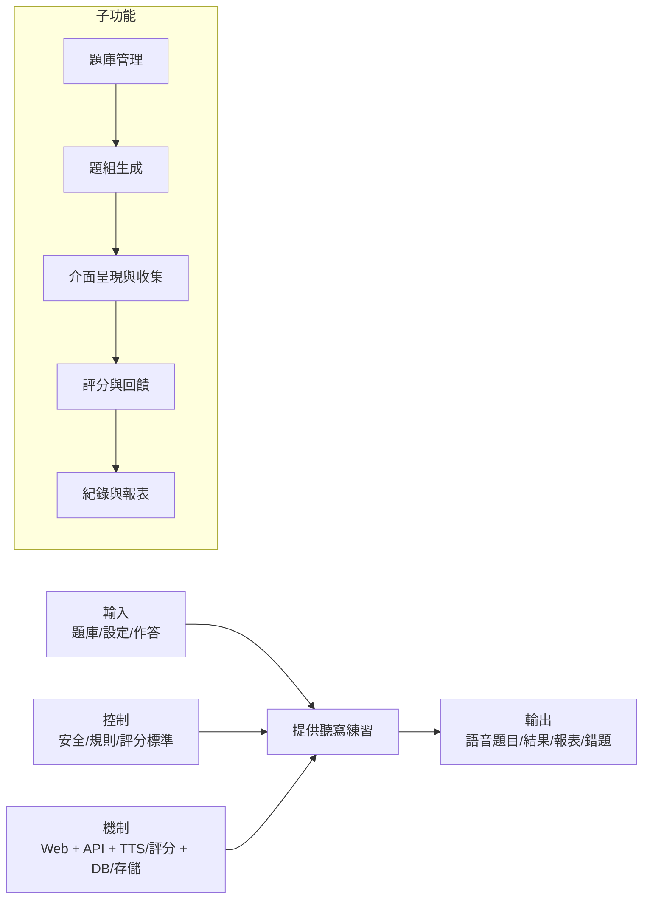

# IDEF0 圖稿（功能：A1_聽寫練習）

## A-0（情境）
- **功能（F）：** 提供兒童聽寫練習
- **輸入（I）：** 題庫字詞、家長出題設定、孩子作答
- **控制（C）：** 安全/隱私政策、練習規則（語速/播放次數）、評分標準
- **機制（M）：** Web 前端、API/worker、TTS/評分服務、資料庫/物件儲存
- **輸出（O）：** 語音題目、作答紀錄、評分結果與報告、錯題清單

## A0 分解
- A1 題庫管理：建立/版控字詞清單；匯入匯出。
- A2 題組生成：依設定抽題，產生 practice_set；觸發語音生成。
- A3 介面呈現與收集：播放語音，收集手寫/鍵盤作答。
- A4 評分與回饋：比對字詞或字形，生成回饋/錯題。
- A5 紀錄與報表：保存結果，供家長查詢與匯出。

## Mermaid 視覺化

## IDEF0 表格化描述
| ID | 名稱 | I (輸入) | C (控制) | O (輸出) | M (機制) |
| --- | --- | --- | --- | --- | --- |
| A1 | 題庫管理 | 字/詞清單、CSV | 權限、版控策略 | 版本化題庫 | API、DB |
| A2 | 題組生成 | 題庫、設定 | 出題規則 | practice_set，TTS 任務 | API、TTS/worker |
| A3 | 介面呈現與收集 | practice_set | UI/UX 規格 | 手寫/輸入回傳 | Web |
| A4 | 評分與回饋 | 作答資料 | 評分標準 | 正確率、提示、錯題 | API、評分服務 |
| A5 | 紀錄與報表 | 評分結果 | 保留策略 | 報表、匯出 | API、DB、存儲 |
