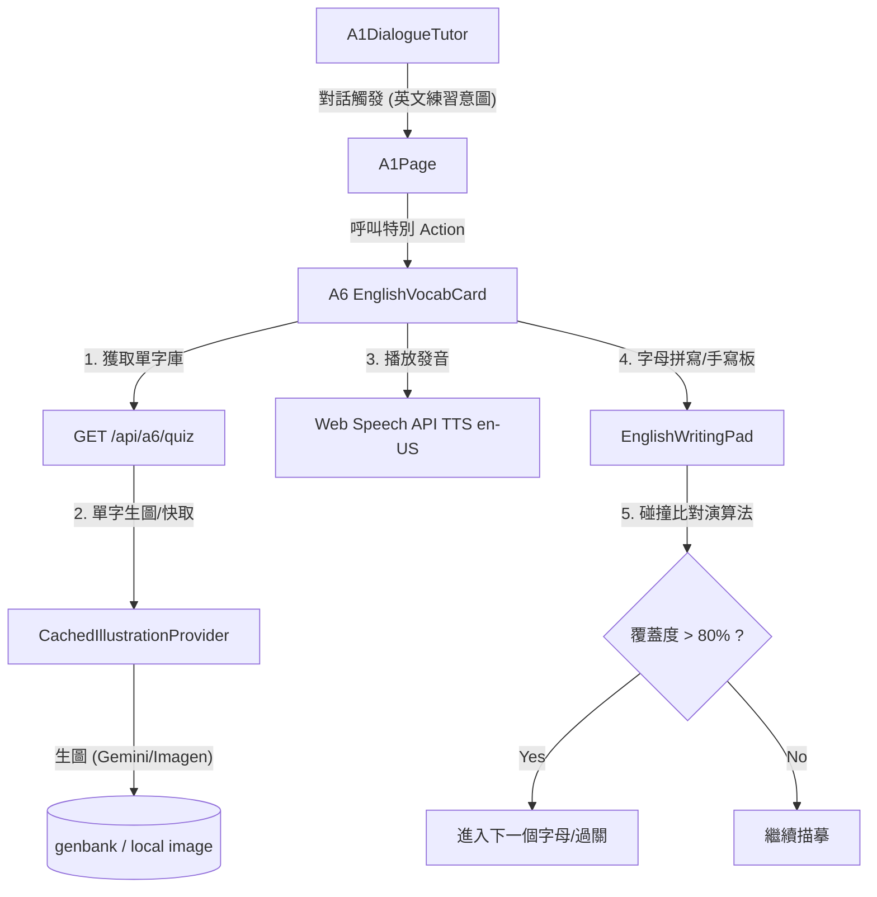

# Proposal: a6_english-vocab-practice

_語言：[zh-hant](./) · **en**_

> Auto-generated index for the `a6_english-vocab-practice` topic. Edit the source files; this README mirrors them. Do not edit this file directly.

## Status

**Verified** · 6 history entries · last advance 2026-06-28 (mode `promote` from implementing)

## Source artifacts

- [`proposal.md`](./proposal.md) — why this exists · modified 2026-06-28
- [`design.md`](./design.md) — architecture & decisions · modified 2026-06-28
- [`tasks.md`](./tasks.md) — checklist · 17/17 done (100%) · modified 2026-06-28
- `.state.json` — lifecycle state machine

## Why (excerpt)

- 「小雞老師」平台目前缺乏英文學習模組。新增 A6 英文單字練習，能健全國小學童在國語字詞（A1）、成語（A2/A7）與數學（A3）之外的英語學習版圖。
- 透過「看圖、聽音、手寫」的多感官互動方式，幫助 6–9 歲兒童更直覺地記憶英文單字及其拼寫。
- 當 A1 對話中偵測到英文練習意圖時，以浮動卡片（Card Overlay）型式顯示練習，能保持既有對話流不中斷，同時流暢切換至專注練習狀態。

[Full →](./proposal.md)

## Architecture overview

[Full design →](./design.md)

## Recent activity

- 2026-06-28: `promote` implementing → verified — All tasks completed, compiled successfully, waiting for user manual visual validation
- 2026-06-28: `promote` planned → implementing — Promote to implementing stage
- 2026-06-28: `promote` designed → planned — Promote to planned stage
- 2026-06-28: `promote` proposed → designed — Headings fixed, promoting to designed
- 2026-06-28: `sync` proposed → proposed — Simplify artifacts requirements to proposal+design+tasks

<!-- AUTO-GENERATED by plan-builder MCP plan_sync · 2026-06-28T16:50:43Z · do not edit this file. -->
