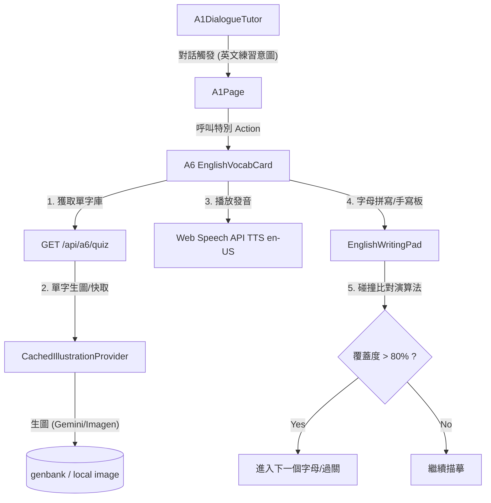

# Design: a6_english-vocab-practice

## Context

本計畫實作「小雞老師」平台內的 A6 英文單字練習卡片。當 A1 家教對話偵測到學童的英文學習意圖時，以浮動卡片（Overlay Card）形式彈出。本功能核心涵蓋圖像顯示、en-US 語音 TTS 朗讀、字母拼寫格子、以及原生 Canvas 像素覆蓋度手寫描摹判定。

## Architecture

## Goals / Non-Goals

### Goals
- 建立具備「看圖、聽音、手寫描摹」三大核心要素的英文單字練習卡片（A6）。
- 與 A1 家教對話無縫整合：對話可依據意圖喚醒 A6 浮動卡片。
- 英文字母手寫板支援精確的描摹判定：不需載入機器學習/OCR 庫，僅透過 HTML5 Canvas 像素比對達成輕量且 100% 準確的字母筆跡覆蓋率判定。
- 比照中文聽寫：可看答案提示，但仍須描摹完成才能通關。
- 零新增套件：完全使用瀏覽器 Web Speech API 與原生 Canvas 實作語音及手寫。

### Non-Goals
- 不做多字連寫或整句英文聽寫（以單字逐字拼寫為主）。
- 不進行草寫、連筆等非標準印刷體字母的複雜手寫識別。

## Decisions

- **DD-1: Web Speech API 語音合成**
  - **選擇**：前端呼叫 `window.speechSynthesis`。
  - **原因**：免費、零延遲、無需後端運算與網路傳輸。設定語系為 `en-US` 或優選的英文發音人。
- **DD-2: Canvas 像素覆蓋度碰撞比對演算法 (Pixel Collision Tracing)**
  - **原理**：
    1. 在離線的 Offscreen Canvas 上，使用粗體字體（如 `Arial` / `Inter` `800`，字級 `180px`）將目標字母繪製為黑底。
    2. 統計該 Offscreen Canvas 上黑色像素（目標點）的總數 $N_{target}$。
    3. 當使用者在手寫 Canvas 上下筆繪製時，將書寫軌跡點投影至該 Offscreen Canvas 上，並標記被軌跡覆蓋（碰撞）的像素。
    4. 計算已碰撞像素點佔總目標點的比例：$\text{Coverage} = \frac{N_{collided}}{N_{target}} \times 100\%$。
    5. 當 $\text{Coverage} \ge 80\%$，且未在字體外部邊界大範圍塗鴉時（可設外部像素碰撞懲罰或限制筆畫範圍），判定該字母「書寫完成」。
  - **原因**：避開引入數 MB 大小的英文 OCR 套件（如 Tesseract.js）或是複雜的模型。輕量、極速、對 6–9 歲兒童描摹印刷體字母極度精準且寬容度好控制。
- **DD-3: A1 對話端 Action 喚醒**
  - **實作**：在 `A1Page` 對話解析中，若發現 AI 回覆中帶有 `action: "start_english_practice"` 與單字清單，前端立刻彈出 A6 浮動卡片，並將單字列表傳入作為該輪練習庫。
- **DD-4: 單字圖像獲取橋接**
  - **實作**：利用後端既有的生圖架構（`CachedIllustrationProvider`），新增後端路由 `/api/a6/quiz` 獲取單字清單時，同步觸發圖片生成與庫存比對。

## Risks / Trade-offs

- **TTS 發音人差異**：不同作業系統與瀏覽器內建的 `en-US` 發音人音質與口音有差異。可接受，實務上現代作業系統（Win/Mac/Android/iOS/Linux Chrome）的英語 TTS 音質已達高水準。
- **寫字字體差異**：演算法繪製的 Offscreen Template 為標準無襯線印刷體（如 Arial）。手寫時若學童書寫的筆劃偏離 Arial 結構太多可能判定不過。可透過加大 template 渲染時的字體粗度（`font-weight: 800`、`lineCap: round`）與碰撞半徑（擴散 10-15px）來提升寬容度，確保 6–9 歲學童能順暢通關。

## Critical Files

- `webapp/frontend/src/features/a6/A6VocabCard.tsx` — A6 英文練習卡片主 UI（浮動 Card）。
- `webapp/frontend/src/features/a6/EnglishWritingPad.tsx` — 英文手寫板與描摹像素碰撞比對核心。
- `webapp/frontend/src/features/a1/A1Page.tsx` — 整合 A6 卡片與 Action 喚起。
- `webapp/backend/src/modules/a6.ts` — 後端英文單字出題與圖像快取協調。
- `webapp/backend/src/server.ts` — 註冊 A6 API 路由。
