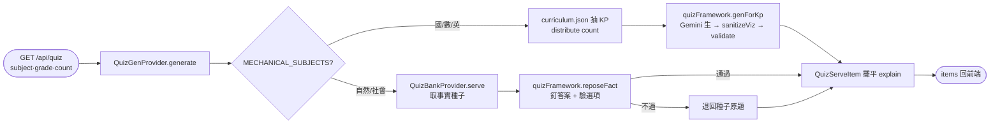

# Proposal: a6_quiz-dynamic-generation

_語言：[zh-hant](./) · **en**_

> Auto-generated index for the `a6_quiz-dynamic-generation` topic. Edit the source files; this README mirrors them. Do not edit this file directly.

## Status

**Verified** · 5 history entries · last advance 2026-06-19 (mode `promote` from implementing)

## Source artifacts

- [`proposal.md`](./proposal.md) — why this exists · modified 2026-06-19
- [`design.md`](./design.md) — architecture & decisions · modified 2026-06-19
- [`tasks.md`](./tasks.md) — checklist · 22/22 done (100%) · modified 2026-06-19
- [`idef0.json`](./idef0.json) + _no SVGs yet_ — formal functional decomposition
- [`grafcet.json`](./grafcet.json) + _no SVGs yet_ — formal runtime behavior
- `.state.json` — lifecycle state machine

## Why (excerpt)

- 學科練習（A6 QuizPage / start_quiz）需要源源不絕的題目。最初做法是「離線批次生題 → 存成 quizbank.json 死題庫」（553 題）。
- 死題庫的問題：會被做完、會重複、會 staleness，無法依小朋友程度客製，還多一個「要不要 commit 幾百道題」的維護包袱。
- 使用者洞察：**「抽取知識點再來 AI 動態生題就好了。下載死題目沒什麼意義。重點是題型框架。」** 真正有複利價值的是「知識點骨架 + 題型框架」，不是凍結的題目。
- 但事實科（自然/社會）不能像數學那樣機械驗證對錯，純動態生會把唯一的審核閘拆掉 → 需要分流處理。

[Full →](./proposal.md)

## Architecture overview

[Full design →](./design.md)

## Recent activity

- 2026-06-19: `promote` implementing → verified — tasks 全勾；backend/frontend tsc 綠；live 驗機制科即時生（連抽不同）、事實科釘答案+變化包裝、/api/quiz/meta 回 26 組科級
- 2026-06-19: `promote` planned → implementing — 功能已實作（quizFramework/quizGenProvider/quizBankProvider/server 路由/資料資產）
- 2026-06-19: `promote` designed → planned — tasks/handoff/errors/observability/test-vectors 完成；已實作功能的任務拆解、停損閘與驗證計畫就緒
- 2026-06-19: `promote` proposed → designed — proposal/spec/design/idef0/grafcet/sequence/data-schema 完成；題型框架單一真相源 + 機制科動態生/事實科釘答案重包裝架構與 DD-1~DD-8 已定
- 2026-06-19: `new` (initial) → proposed — initial spec created via plan-init.ts

## Cross-links

### Code anchors

- `webapp/backend/src/providers/quizFramework.ts` — 題型框架單一真相源（SUBJECT_PLAN, buildResponseSchema, buildPrompt, sanitizeViz, validate, callGemini, genForKp, reposeFact）。
- `webapp/backend/src/providers/quizGenProvider.ts` — QuizGenProvider：全科 runtime 生題編排（機制科 curriculum 路徑、事實科種子重包裝路徑、distribute、meta）。
- `webapp/backend/src/providers/quizBankProvider.ts` — QuizBankProvider：事實種子池（讀 quizbank.json，依 subject/grade serve 種子、meta）。
- `webapp/backend/src/server.ts` — `/api/quiz` 與 `/api/quiz/meta` 路由（全走 quizGen）。
- `webapp/backend/data/curriculum.json` — 知識點骨架。

_… and 3 more · [full list →](./design.md#code-anchors)_

<!-- AUTO-GENERATED by plan-builder MCP plan_sync · 2026-06-19T04:38:23Z · do not edit this file. -->
