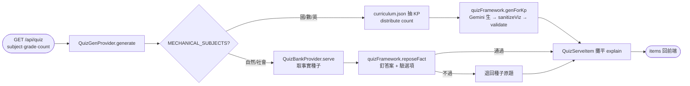

# Design: a6_quiz-dynamic-generation

## Architecture

題型框架 `quizFramework.ts` 是單一真相源：runtime（QuizGenProvider）與 CLI（scripts/gen-quizbank）共用同一份 SUBJECT_PLAN / responseSchema / prompt / sanitizeViz / validate / reposeFact，所以「永不畫錯」與「釘答案」的契約不會 drift。

兩個小資產（可進 git、可審）：
- `curriculum.json` — 知識點骨架（WHAT），111 KP × 26 組科級。
- `quizbank.json` — 事實種子池（自然/社會 120 條，reviewed:false 待審）。

## Context

學科練習出題後端。前置：a1 對話家教（start_quiz 意圖）、a1_quiz_overlay（QuizPage 出題畫面）、a6_quiz-voice-answer（語音作答）。本 plan 只負責「題目從哪來」——把原本的離線死題庫改成 runtime 生成引擎，並收斂成單一題型框架。

## Goals / Non-Goals

### Goals
- 全科 runtime 動態生題，後端不存機制科死題。
- 題型框架單一真相源（runtime 與 CLI 共用）。
- 事實科安全生成：同一事實、變化包裝、釘答案。
- 數學圖解永不畫錯（viz 安全網）。

### Non-Goals
- 機制科題目持久化/離線題庫。
- 事實科自動事實查核（靠釘種子答案，不靠二次 AI）。
- 前端出題畫面、語音作答（屬其他 plan）。

## Decisions

- **DD-1**: 不存死題——框架才是資產。機制科題目能機械驗證、可無限生，存死題只會被做完/重複/staleness，故 runtime 動態生、後端不持久化機制科題。
- **DD-2**: 機制科 vs 事實科分流，依「能否機械驗證」而非科目偏好。國/數/英 的答案可由算式/規則驗證 → 動態生；自然/社會 是事實、機器驗不出對錯 → 不可純動態生答案。
- **DD-3**: 事實科用「種子重包裝、釘答案」而非靜態池或二次 AI 自查。從已確認的事實種子（題幹核心＋正確答案）出發，叫模型重出選擇題，**正解必須一字不差等於種子答案**、選項含正解且互異；任一不過就退回種子原題。如此事實題永遠出對答案、又能無限變化包裝。人工審核對象縮小成 ~120 條種子，而非無限題目。
- **DD-4**: viz 安全網（sanitizeViz）是「永不畫錯」的結構保證，不靠模型自律。count → result=total±operand；groups → result=groups×per；icon 只收單一 emoji。算式對不上就剝掉 viz（保留題目、丟掉圖解），不把不一致的圖解餵給前端確定性 SVG。
- **DD-5**: 題型框架單一真相源。SUBJECT_PLAN/schema/prompt/sanitizeViz/validate/reposeFact 全集中於 quizFramework.ts；runtime 與離線 CLI 都引它，避免兩份安全網拷貝 drift。
- **DD-6**: `/api/quiz/meta` 範圍合併。機制科範圍來自 curriculum.json（全級皆可生），事實科範圍來自種子池實況（quizBank.meta()），合併回前端 setup 下拉。
- **DD-7**: count 分配到多個知識點（distribute：洗牌後 round-robin），讓一組題跨知識點有變化，而非同一 KP 連出。
- **DD-8**: 事實重包裝失敗的 fail-safe 是「退回種子原題」，不是丟棄。最差情況小朋友看到的是審過的種子題，絕不會出到錯答案。

## Risks / Trade-offs

- **延遲**：runtime 生題每次打 Gemini（機制科 ~KP 數個並行呼叫、事實科 ~count 個並行呼叫）→ QuizPage 有 loading 等待。可接受；前端 loading phase 已涵蓋。
- **可用性**：依賴 Gemini 在線；上游全掛時無法出題（不像死題庫可離線）。事實科有種子退回，但種子退回本身仍需先取種子（本地檔，可離線）；機制科無離線後備。
- **成本**：每次練習消耗 Gemini 呼叫（vs 一次性離線生）。在免費 tier + round-robin 金鑰內。
- **事實種子品質**：種子是早先 AI 生、reviewed:false，可能有偏難/偏長題。釘答案保證答案正確，但題幹品質仍待人工審那 ~120 條種子。
- **框架雙拷貝（暫時）**：scripts/gen-quizbank.mjs 仍留一份框架，與 quizFramework.ts 並存；目前同步，待併入消除 drift 風險。

## Critical Files

- `webapp/backend/src/providers/quizFramework.ts` — 題型框架單一真相源。
- `webapp/backend/src/providers/quizGenProvider.ts` — runtime 生題編排。
- `webapp/backend/src/providers/quizBankProvider.ts` — 事實種子池。
- `webapp/backend/src/server.ts` — /api/quiz 路由。
- `webapp/backend/data/curriculum.json` / `quizbank.json` — 兩個小資產。

## Code anchors

- `webapp/backend/src/providers/quizFramework.ts` — 題型框架單一真相源（SUBJECT_PLAN, buildResponseSchema, buildPrompt, sanitizeViz, validate, callGemini, genForKp, reposeFact）。
- `webapp/backend/src/providers/quizGenProvider.ts` — QuizGenProvider：全科 runtime 生題編排（機制科 curriculum 路徑、事實科種子重包裝路徑、distribute、meta）。
- `webapp/backend/src/providers/quizBankProvider.ts` — QuizBankProvider：事實種子池（讀 quizbank.json，依 subject/grade serve 種子、meta）。
- `webapp/backend/src/server.ts` — `/api/quiz` 與 `/api/quiz/meta` 路由（全走 quizGen）。
- `webapp/backend/data/curriculum.json` — 知識點骨架。
- `webapp/backend/data/curriculum.schema.json` — 兩層資料契約（骨架 + 帶 provenance 的題目）。
- `webapp/backend/data/quizbank.json` — 事實種子池（自然/社會 120 條）。
- `scripts/gen-quizbank.mjs` — 離線生題 CLI（補事實種子用；目前仍保留一份框架拷貝，待併入 quizFramework）。

## Submodule refs

無。
