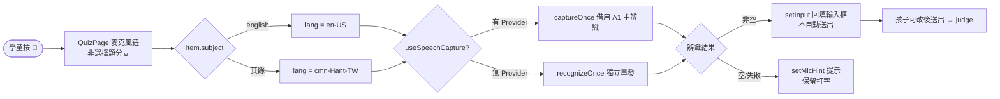

# Proposal: a6_quiz-voice-answer

_語言：[zh-hant](./) · **en**_

> Auto-generated index for the `a6_quiz-voice-answer` topic. Edit the source files; this README mirrors them. Do not edit this file directly.

## Status

**Implementing** · 4 history entries · last advance 2026-06-19 (mode `promote` from planned)

## Source artifacts

- [`proposal.md`](./proposal.md) — why this exists · modified 2026-06-19
- [`design.md`](./design.md) — architecture & decisions · modified 2026-06-19
- [`tasks.md`](./tasks.md) — checklist · 9/10 done (90%) · modified 2026-06-19
- [`idef0.json`](./idef0.json) + _no SVGs yet_ — formal functional decomposition
- [`grafcet.json`](./grafcet.json) + _no SVGs yet_ — formal runtime behavior
- `.state.json` — lifecycle state machine

## Why (excerpt)

- 學科練習（A6 QuizPage）的填空/造詞/跟讀題用文字輸入框作答（placeholder「把答案打進來…」）。
- 目標使用者是國小低年級學童，**還不會中文輸入法**，無法把「國語」題的中文答案打進去——這是實際使用障礙，等同把這些題型對小小孩封死。
- App 已有成熟語音基礎建設（A1 常駐中文辨識 + 英文跟讀「借用主辨識」契約），缺的只是把它接到 QuizPage 的作答框。

[Full →](./proposal.md)

## Architecture overview

[Full design →](./design.md)

## Recent activity

- 2026-06-19: `promote` planned → implementing — 本 session 已完成實作（QuizPage.tsx 麥克風鈕 + listen()）；補登實作狀態
- 2026-06-19: `promote` designed → planned — tasks/handoff/errors/observability/test-vectors 完成；單檔變更任務拆解就緒
- 2026-06-19: `promote` proposed → designed — proposal/spec/design/idef0/grafcet/sequence/data-schema 完成；架構與決策已定
- 2026-06-19: `new` (initial) → proposed — initial spec created via plan-init.ts

## Cross-links

### Code anchors

- `webapp/frontend/src/features/a6/QuizPage.tsx` `listen` — 語音擷取處理（借用主辨識 / 退回獨立辨識 → 回填 input）
- `webapp/frontend/src/features/a6/QuizPage.tsx` `QuizPage` — `useSpeechCapture()` 借用、輸入框 + 麥克風鈕橫列、micHint 提示
- `webapp/frontend/src/features/a1/speechCapture.ts` `useSpeechCapture` — 借用主辨識契約入口
- `webapp/frontend/src/shared/speech/recognizeOnce.ts` `recognizeOnce` — 無 Provider 時的獨立單發辨識退路

<!-- AUTO-GENERATED by plan-builder MCP plan_sync · 2026-06-19T04:24:33Z · do not edit this file. -->
