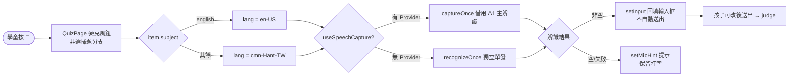

# Design: a6_quiz-voice-answer

## Architecture

## Context

A6 `QuizPage` 是「學科練習」全螢幕 overlay：從 quizbank 出題 → 停下等作答 → 即時批改 → 揭曉講解/圖解 → 回流成績卡。選擇題用按鈕點選；其餘題型（fill / make_word / read_aloud）用單一文字輸入框作答。

低年級學童不會中文輸入法，國語類填空題的中文答案無法輸入。App 既有兩套語音能力：
- A1Page 常駐中文辨識（鎖 `cmn-Hant-TW`、含 VAD/echo/自我修復），透過 `SpeechCaptureContext` 對子元件曝露「借用一次」入口 `captureOnce`。
- `recognizeOnce(lang)`：獨立、用完即丟的單發辨識（英文跟讀在沒有 Provider 時的退路）。

QuizPage 已渲染在 A1Page 的 `SpeechCaptureContext.Provider` 內（A1Page.tsx 的 Provider 包住 overlay），因此可直接借用主辨識。

## Goals / Non-Goals

### Goals
- 填空類題型可「用說的」作答，辨識文字回填輸入框供修改後送出。
- 不與 A1 主辨識搶麥克風。
- 視覺與互動沿用既有跟讀麥克風鈕，零新 CSS。

### Non-Goals
- 不動出題/批改/計分/圖解。
- 不重寫語音辨識核心。
- 不處理口說中文數字→阿拉伯數字的批改正規化（已知限制）。

## Decisions

- **DD-1**：語音作答只接在**非選擇題**分支（fill / make_word / read_aloud）。選擇題已是點選互動，加語音無意義。辨識結果回填 `input` state，與打字共用同一送出路徑（`submit()` 讀 `input`），不另開批改路徑。
- **DD-2**：辨識結果**只回填、不自動送出**。理由：辨識可能有誤，低年級需要看到結果並能修改；自動送出會讓錯字直接被批為錯，挫折感高。
- **DD-3**：優先**借用 A1 主辨識**（`useSpeechCapture().captureOnce({lang})`），不在 Provider 內時退回 `recognizeOnce(lang)`。理由：複用英文跟讀已驗證的「借用主辨識」契約，避免第二支 SpeechRecognition 與常駐中文辨識搶同一支麥克風互相弄聾（與 a1_quiz_overlay DD-5、English follow-along 同源約束）。
- **DD-4**：辨識語言依**科目**決定——`item.subject === 'english' ? 'en-US' : 'cmn-Hant-TW'`。國語/數學都走中文辨識（中文 locale 對口說數字多能回阿拉伯數字，數學夠用；國語為主要受益者）。
- **DD-5**：失敗 fail-soft——`captureOnce`/`recognizeOnce` reject 或回空字串時，設 `micHint`（「沒聽到，再按一次麥克風喔」/「沒聽清楚，再說一次好嗎？」），不丟例外、不阻斷作答；孩子仍可改用打字。
- **DD-6**：`listening` / `micHint` 狀態在 `next()`（換題）與 `start()`（新測驗）時重置，避免提示殘留到下一題。

## Risks / Trade-offs

- **R1（中）**：實機麥克風權限/瀏覽器支援差異。緩解：DD-5 fail-soft，永遠保留打字退路；不支援時 `recognizeOnce` 直接 reject 進提示。
- **R2（中）**：數學口說中文數字（「十二」）辨識回中文字時，現有 `judge()` 的數值容忍（`Number()`）無法配對 → 判錯。緩解：本次不處理，列為 proposal OUT 的後續；語音對國語題（主要訴求）不受影響。
- **R3（低）**：借用主辨識切語言（英文題切 en-US）後是否乾淨切回。緩解：沿用既有 captureOnce 契約（用後語言切回），與英文跟讀同路徑、已驗證。

## Critical Files

- `webapp/frontend/src/features/a6/QuizPage.tsx` — 唯一變更檔：麥克風鈕、`listen()`、`listening`/`micHint` 狀態、輸入框橫列。

## Code anchors

- `webapp/frontend/src/features/a6/QuizPage.tsx` `listen` — 語音擷取處理（借用主辨識 / 退回獨立辨識 → 回填 input）
- `webapp/frontend/src/features/a6/QuizPage.tsx` `QuizPage` — `useSpeechCapture()` 借用、輸入框 + 麥克風鈕橫列、micHint 提示
- `webapp/frontend/src/features/a1/speechCapture.ts` `useSpeechCapture` — 借用主辨識契約入口
- `webapp/frontend/src/shared/speech/recognizeOnce.ts` `recognizeOnce` — 無 Provider 時的獨立單發辨識退路
